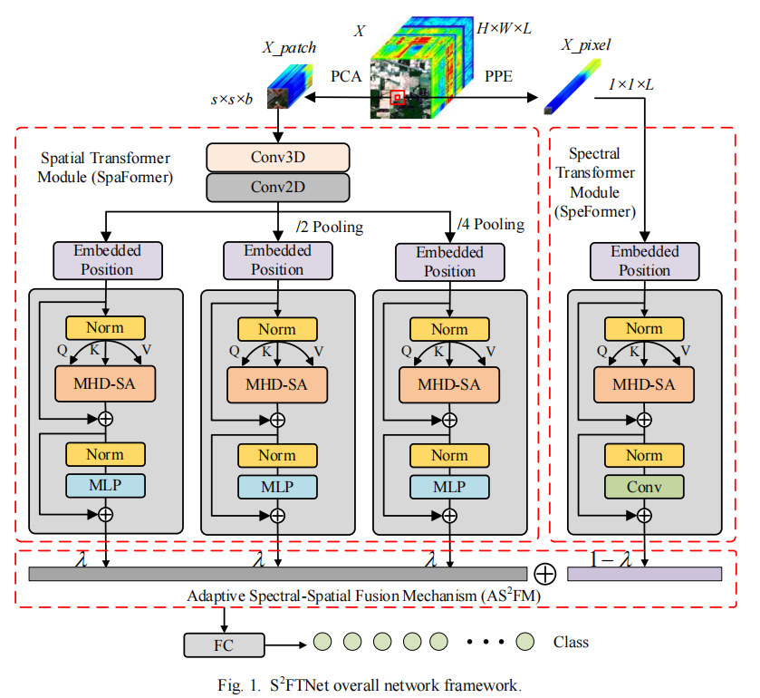

# A Spectral-Spatial Fusion Transformer Network for Hyperspectral Image Classification

[Diling Liao](liaodiling2020@163.com), [Cuiping Shi](scp1980@126.com), [Tianyu Zhang]( 2019910178@qqhru.edu.cn), [Liguo Wang]( wangliguo@hrbeu.edu.cn)
___________

The code in this toolbox implements the ["A Spectral-Spatial Fusion Transformer Network for Hyperspectral Image Classification"]. More specifically, it is detailed as follow.

Citation
---------------------

**Please kindly cite the papers if this code is useful and helpful for your research.**

D. Liao, C. Shi, L. Wang, "A Spectral-Spatial Fusion Transformer Network for Hyperspectral Image Classification," in IEEE Trans. on Geoscience and Remote Sensing.2023.
    
System-specific notes
---------------------
The codes of networks were tested using PyTorch 1.10.0 version (CUDA 11.3) in Python 3.8 on Ubuntu system.

How to use it?
---------------------
This toolbox consists of two proposed branchs, i.e., Strategy for Extracting Spectral Features Based on MSSP and Strategy for Extracting Spatial Features, that can be plug-and-played into both pixel-wise and patch-wise hyperspectral image classification. For more details, please refer to the paper.

Here an example experiment is given by using **Indian Pines hyperspectral data**. Directly run **demo_IP.py** functions with different network parameter settings and input **IP** to produce the results. Please note that due to the randomness of the parameter initialization, the experimental results might have slightly different from those reported in the paper.

If you want to run the code in your own data, you can accordingly change the input (e.g., data, labels) and tune the parameters.

If you encounter the bugs while using this code, please do not hesitate to contact us.

If emergency, you can also add my email: liaodiling2020@163.com or QQ: 3097264896.
